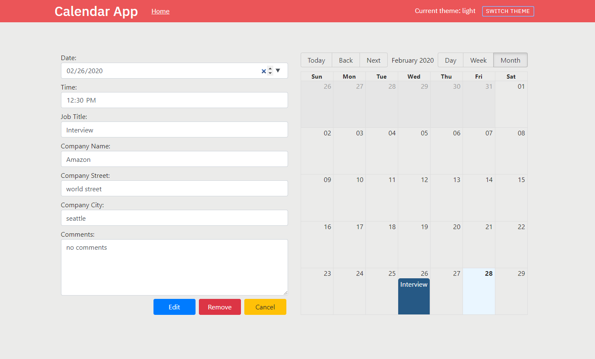
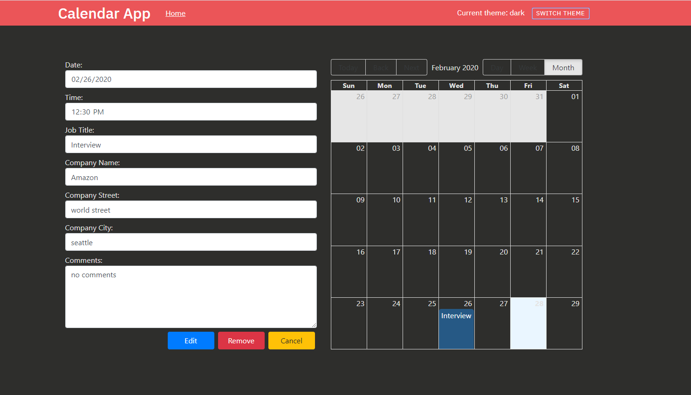

# react-redux-typescript-calendar

This project was bootstrapped with <http://github.com/sw-yx/create-react-app-parcel>.

> Light Theme



> Dark Theme



## Getting started

A Node.js 8.0.0+ setup with [yarn](https://yarnpkg.com/) is recommended.

```bash
# install dependencies
yarn

# ...or if you'd like to use npm instead
npm install

# serve with hot reload at localhost:4000
yarn start
## or
npm start

# build for production
yarn build
```
